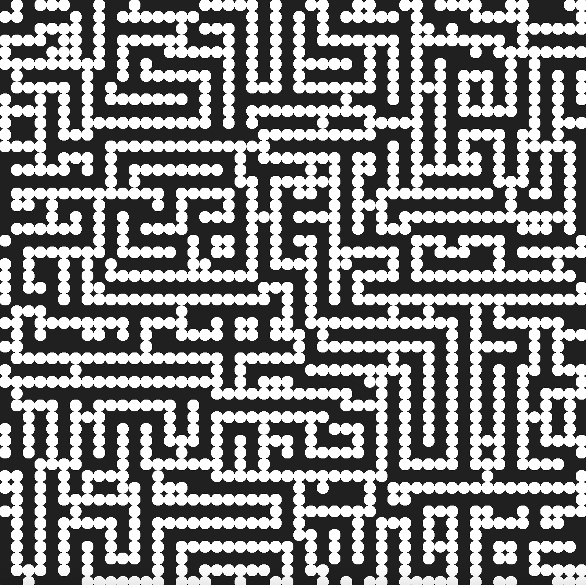
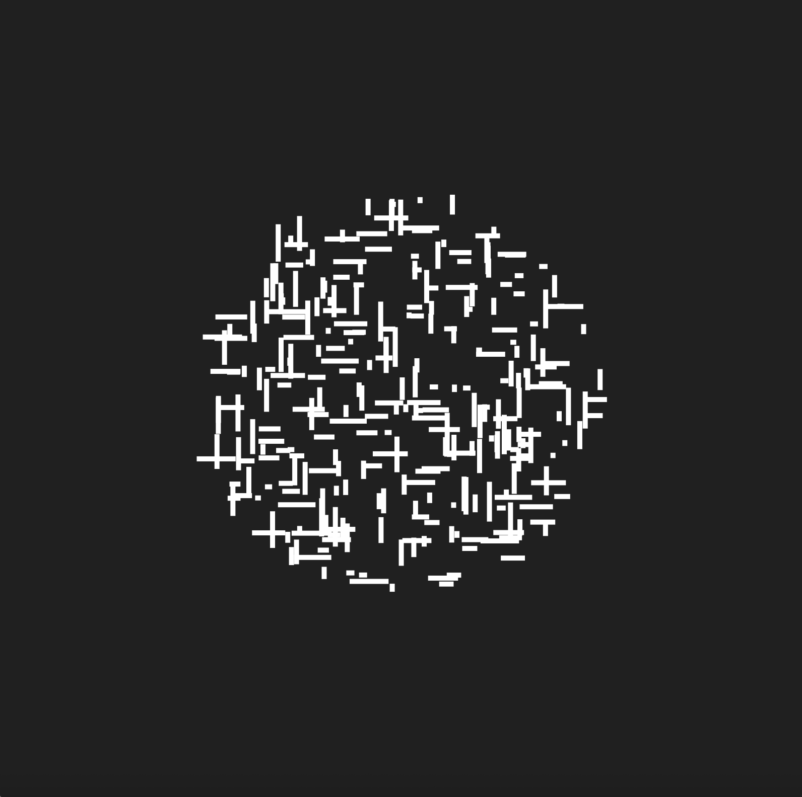
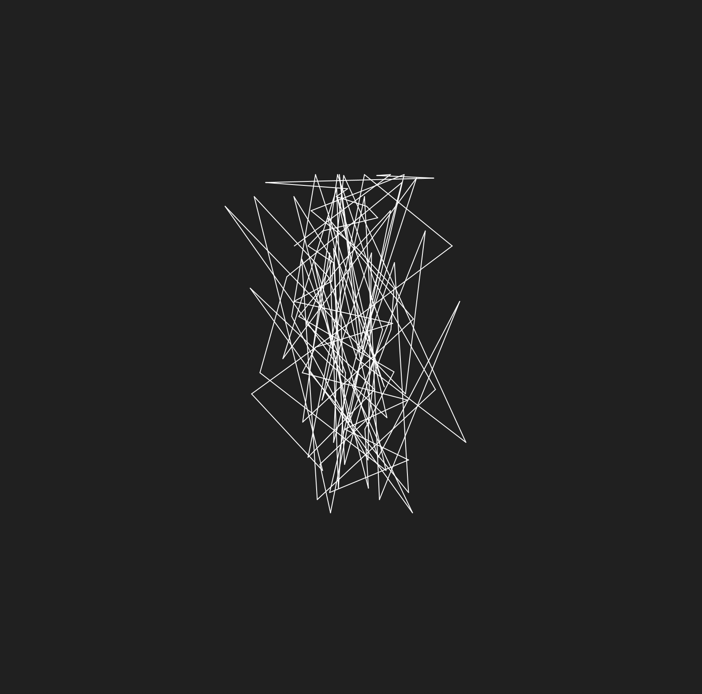
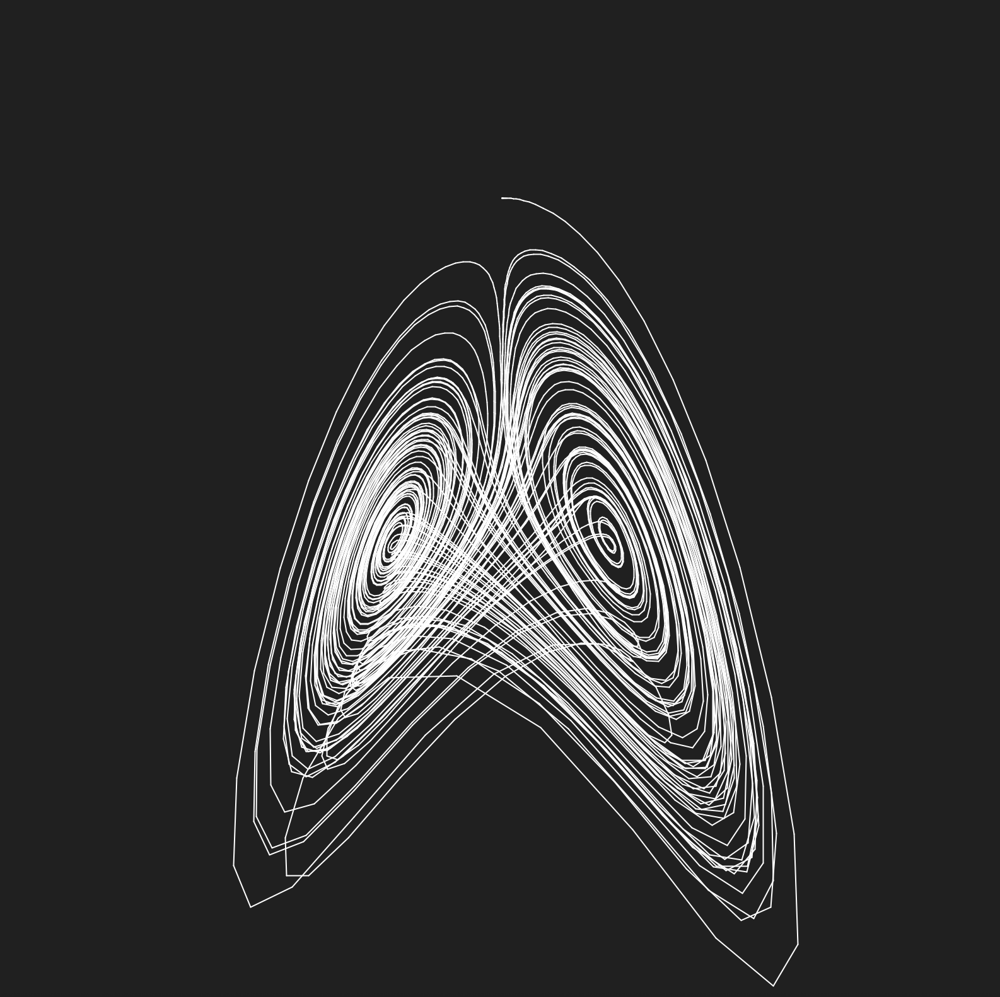
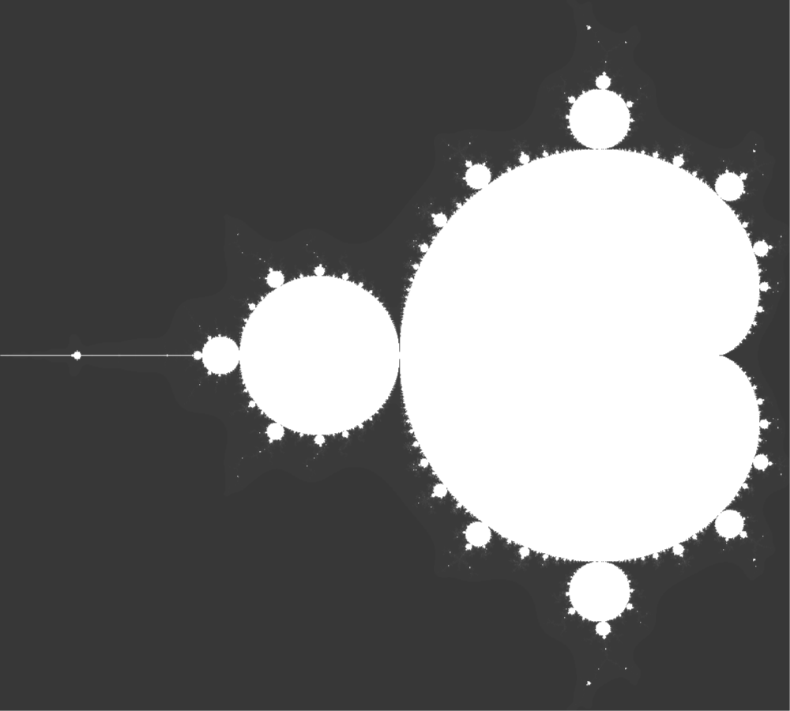
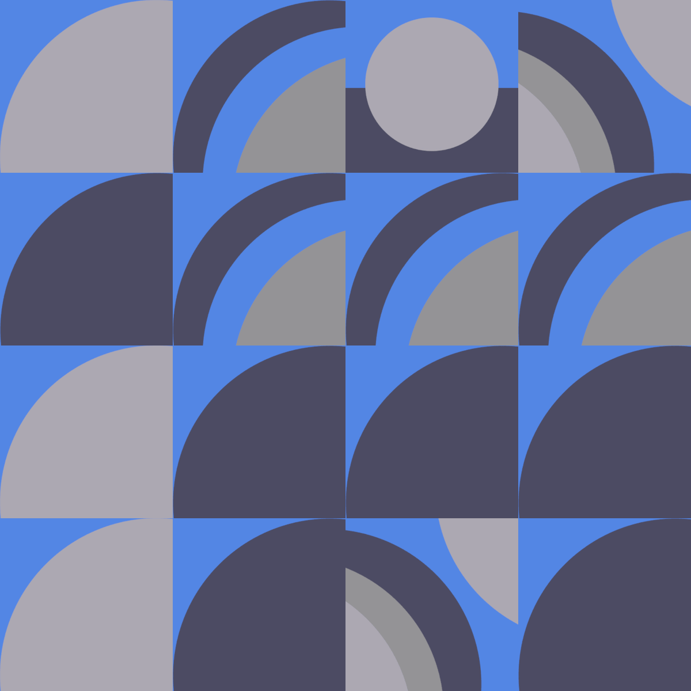

# Processing projects

This repository will host a group of artistic scripts, no techinicism, no AI, only fun.

## Some results


*`bela_julesz` - output*

-


*`Computer_composition_with_lines` - output*

-


*`Gaussian_quadratic` - output*

-


*`attractors` - output*

-


*`fract_bnw` - output*

## Gifs creation

gifs are created in mac with `magick`: 

``` Bash
magick convert -delay 1 -loop 0 screenshot-*.png animation.gif
```




## Resources

- More info about the work of Bela Julesz here:
https://doi.org/10.1556/HSTUD.20.2006.2.5 , BELA JULESZ A N D "SCIENTIFIC BILINGUALISM, Ilona Kovács.
- More info about the work of Michael Noll here:
https://doi.org/10.1109/MSPEC.1967.5217127 , The digital computer as a creative medium, A. Michael Noll.
